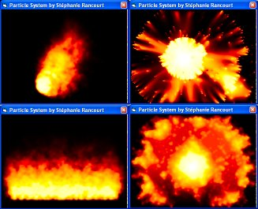



## Particle system \(Fire\)

### Description

It's a particle graphic effect, it simulate mainly fire.It feature also blurring effect.Execute the bat files. 16bit color depth not fully supported
 
### More Info
 
There's a lot of parameters to pass through the command line to customize the particle system

a real-time generated animation of the particle system

works only in 32bit color depth, 16bit isn't fully supported

             |
---                |---
**Submitted On**   |2002-07-23 15:05:36
**By**             |[nie](https://github.com/Planet-Source-Code/PSCIndex/blob/master/ByAuthor/nie.md)
**Level**          |Intermediate
**User Rating**    |4.9 (182 globes from 37 users)
**Compatibility**  |VB 6\.0
**Category**       |[Graphics](https://github.com/Planet-Source-Code/PSCIndex/blob/master/ByCategory/graphics__1-46.md)
**World**          |[Visual Basic](https://github.com/Planet-Source-Code/PSCIndex/blob/master/ByWorld/visual-basic.md)
**Archive File**   |[Particle\_s1096757232002\.zip](https://github.com/Planet-Source-Code/nie-particle-system-fire__1-37194/archive/master.zip)

